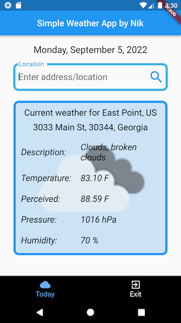

# flutter-weather-app

## simple weather app built with Flutter - from idea to submitting to Google Play

In the project directory, run to launch the project:

### `flutter run`, to run in development mode

## the libraries used in project:
* splash_screen_view: ^3.0.0 - splash screen
* assets_audio_player: ^3.0.5 - to play sounds
* intl: ^0.17.0 - to format date
* http: ^0.13.4 - to make api calls
* geocoding: ^2.0.5 - to convert location or partioal address into lat, lon

## Project Screenshots:

